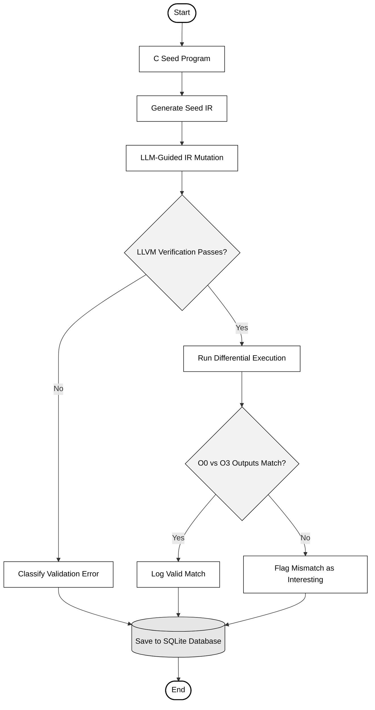
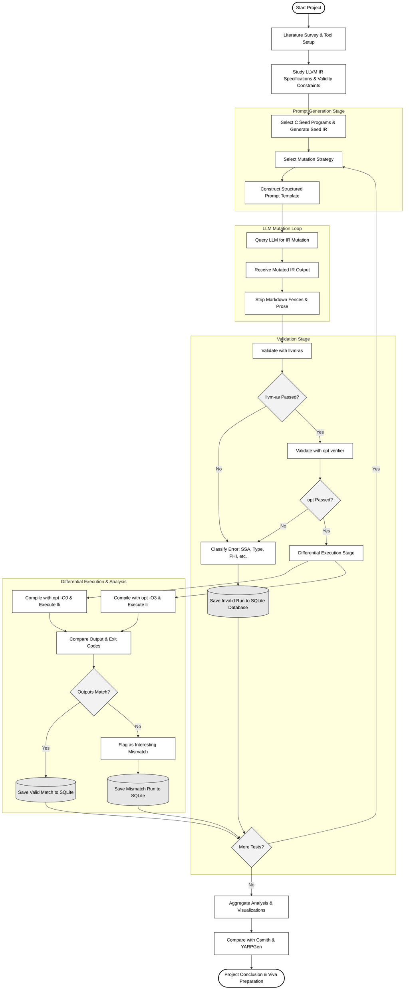
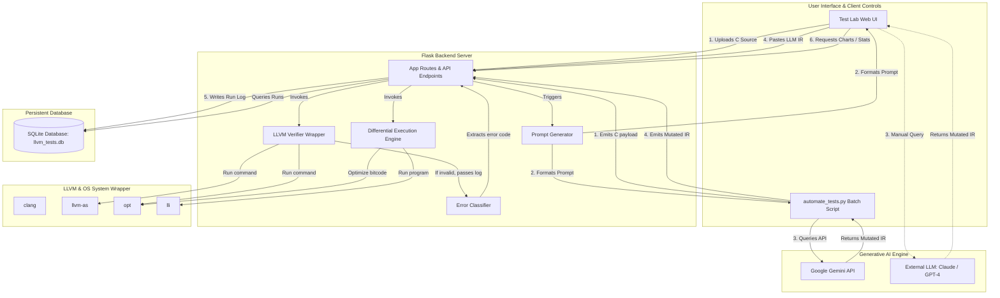
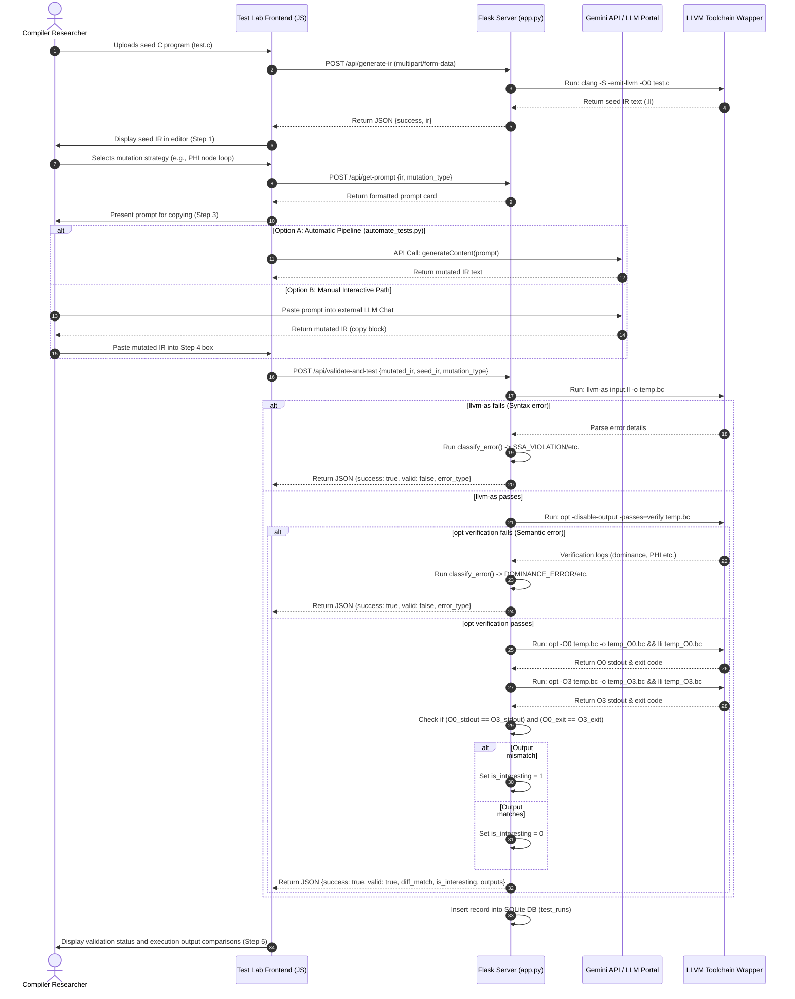

# LLM-Guided LLVM Intermediate Representation Mutation for Differential Compiler Testing

---

## 1. Project Title
**LLM-Guided LLVM Intermediate Representation Mutation for Differential Compiler Testing: An Evaluative Study of Generative AI vs. Traditional Fuzzing Infrastructure**

---

## 2. Problem Statement

### Background and Context
Compilers are the foundation of modern software engineering. They translate high-level source code (e.g., C, C++, Rust) into optimized machine instructions. To deliver high-performance executables, modern compiler suites such as LLVM incorporate extremely complex, multi-layered optimization frameworks. These frameworks perform hundreds of transformation passes to reduce code size, eliminate redundancies, and exploit target processor architectures. 

However, this complexity makes compilers prone to optimization bugs (miscompilations), where the compiler incorrectly changes the semantics of a valid program during optimization. Discovering these bugs is critical because they result in silent runtime errors, security vulnerabilities, or system crashes that are exceptionally difficult to diagnose.

### Existing Approaches
To ensure compiler correctness, the systems software community has historically relied on automated testing strategies:
1. **Random Program Generators (e.g., Csmith):** Csmith generates random, syntactically and semantically valid C programs. It avoids undefined behavior (UB) by inserting defensive checks. These programs are compiled at different optimization levels to verify semantic equivalence.
2. **Grammar-Based Fuzzers (e.g., YARPGen):** YARPGen generates random programs while systematically avoiding undefined behaviors through static analysis and semantic design rules.
3. **Coverage-Guided Fuzzers (e.g., AFL, libFuzzer):** These tools perform byte-level mutations on compiler inputs to maximize code coverage in the compiler frontend or parser.

### Current Limitations
While traditional fuzzers are highly effective, they suffer from several fundamental limitations:
- **Frontend Dependency:** Tools like Csmith and YARPGen generate high-level C code. Consequently, they test the entire compiler pipeline (parser, AST builder, type checker, code generator) and cannot easily focus on middle-end optimization passes where the most complex optimization logic resides.
- **Syntactic and Semantic Fragility of IR Fuzzing:** Directly fuzzing LLVM Intermediate Representation (IR) using random byte-level mutations is highly inefficient. Because LLVM IR has a strict type system and structural requirements, random changes almost always lead to syntax errors, Static Single Assignment (SSA) violations, or dominance failures, causing the IR to be instantly rejected by the compiler's verification stage.
- **Oracle Limitations:** Coverage-guided fuzzers are designed to find compiler crashes (e.g., segmentation faults), but they struggle to detect silent miscompilations where the compiler generates incorrect code but runs to completion without crashing.

### Why LLVM IR Generation is Difficult
Generating or mutating LLVM IR directly is an open challenge due to the rigid mathematical and logical constraints enforced by the LLVM abstract machine:
- **Static Single Assignment (SSA) Form:** Every register variable must be defined exactly once, and every use of a variable must be dominated by its single definition.
- **Strong Type System:** Instruction operands must have perfectly matching types (e.g., adding an `i32` to an `i64` is invalid without explicit casting).
- **Control Flow and Dominance:** Control Flow Graphs (CFGs) must maintain correct dominance relationships. A basic block can only reference variables defined in blocks that dominate it.
- **PHI Nodes:** PHI nodes, which merge values from predecessor blocks, must contain exactly one entry for every predecessor block in the CFG. Missing or extra predecessors trigger immediate verification errors.
- **Undefined Behavior (UB), Undef, and Poison:** LLVM IR has precise rules regarding undefined behavior. The compiler optimizer aggressively exploits UB. A mutated IR that accidentally introduces UB may cause the optimizer to legally eliminate code blocks, resulting in false-positive bug reports.

### Why Large Language Models (LLMs) May Help
Large Language Models (LLMs) represent a paradigm shift in software testing. Unlike grammar-based generators that rely on hardcoded rules, LLMs are trained on billions of lines of code, enabling them to understand programming language semantics, context-sensitive constraints, and structural patterns. 

By utilizing structured, instruction-guided prompts, LLMs can perform sophisticated, context-aware mutations on LLVM IR. They can preserve SSA properties, adjust type definitions across a program, build valid Control Flow Graphs, and update PHI node structures. This capacity for semantic reasoning makes LLMs uniquely suited to generate valid compiler inputs that are beyond the reach of traditional random mutators.

### Motivation and Research Gap
While LLMs have demonstrated capabilities in high-level code generation, their ability to generate and mutate low-level intermediate representations like LLVM IR remains largely unexplored. Most research focuses on source-to-source mutation. 

This project addresses this research gap by establishing a quantitative framework to evaluate the viability, validity, and bug-finding capabilities of LLM-guided LLVM IR mutations. By comparing LLM-generated test cases directly against state-of-the-art generators (Csmith, YARPGen), this research assesses whether generative AI can generate diverse, valid compiler test cases that stress middle-end optimization passes.

### Importance of the Project
This project contributes to compiler reliability and system security. By developing a reproducible pipeline for LLM-based differential testing, it provides compiler engineers with a tool to explore edge cases in optimization passes. Furthermore, analyzing the failure modes of LLM-generated IR provides insights into the spatial reasoning and formal-logic limitations of current generative AI models.

---

## 3. Objectives

### Primary Objective
To design, implement, and evaluate a prototype system that leverages Large Language Models (LLMs) to perform semantically valid mutations on LLVM Intermediate Representation (IR), and to run differential compiler testing to discover optimization-related compiler bugs.

### Specific Objectives
* **Develop Prompt Templates:** Create structured, category-specific prompt templates for six distinct LLVM IR mutation strategies: arithmetic instruction insertion, integer type conversion, conditional branch insertion, loop/PHI node insertion, dead code insertion, and operand swapping.
* **Build Validation Pipeline:** Implement an automated validation system using the `llvm-as` assembler and the LLVM `opt` verifier to screen out structurally and syntactically invalid IR.
* **Implement Differential Testing Engine:** Build an execution pipeline using the `lli` bitcode interpreter to compare program output and exit codes between unoptimized (`-O0`) and optimized (`-O3`) IR.
* **Categorize Failure Modes:** Develop a keyword-based heuristic classifier to analyze validation failures (e.g., SSA violations, type mismatches, dominance errors) and quantify LLM correctness rates.
* **Integrate Automation:** Create a batch testing script utilizing the Gemini API to systematically evaluate mutations across multiple seed C programs.
* **Conduct Comparative Analysis:** Evaluate the semantic validity, test case diversity, and bug-finding efficiency of LLM-guided mutations in comparison to traditional tools like Csmith and YARPGen.
* **Visualize Results:** Design an interactive web dashboard using Flask and Chart.js to aggregate execution runs, show validity rates, and highlight "interesting" output mismatches.

### Scope of the Project
* **Input Constraints:** The prototype accepts single-file, deterministic C programs as input (no interactive input, no external networking).
* **Target Environment:** The system targets the LLVM toolchain (Clang, llvm-as, opt, lli) running on Linux or macOS.
* **Optimization Gap:** Differential testing is performed by comparing `-O0` (baseline) against `-O3` (high optimization).
* **LLM Integration:** The batch pipeline integrates with the Google Gemini API (e.g., `gemini-2.5-flash`), while the web interface allows manual interaction with other LLM models (e.g., Claude, GPT-4).

### Limitations
* **Model Hallucinations:** LLMs are non-deterministic and can generate invalid LLVM IR assembly syntax or embed natural language explanations that fail compilation.
* **API Rate Limits and Latency:** Running automated tests via cloud-based APIs is subject to rate limiting and network latency, making it slower than local compiler-guided fuzzers.
* **Interpreter Divergence:** Using `lli` (the LLVM interpreter/JIT) isolates execution from concrete hardware-level code generation bugs that might only occur when compiling to native assembly (using `llc` and `gcc`/`clang`).
* **Deterministic Focus:** The differential testing oracle assumes program determinism; multithreaded or non-deterministic programs are outside the scope of this project.

---

## 4. Methodology

### A. Flowcharts

#### 1. High-Level Simplified Flowchart (Black & White)



#### 2. Detailed Methodology Flowchart (Black & White)



---

### B. Methodology Explanation

#### 1. Literature Survey
* **Purpose:** To understand the history of compiler testing, study standard fuzzer architectures, and explore LLM application boundaries in code generation.
* **Input:** Scientific publications on Csmith, YARPGen, compiler bug classification, and LLM code-generation papers.
* **Process:** Reviewing academic databases (ACM, IEEE, arXiv) to trace compiler verification techniques.
* **Output:** A comprehensive literature review mapping compiler mutation testing methods.
* **Expected Result:** Clear identification of the research gap regarding direct LLVM IR mutation using Large Language Models.

#### 2. LLVM IR Study
* **Purpose:** Gain deep domain expertise in the structure, constraints, and semantics of LLVM Intermediate Representation.
* **Input:** Official LLVM Language Reference Manual (LLVM Language Ref).
* **Process:** Inspecting textual `.ll` files generated from different C constructs to identify formatting styles, global variables, basic block markers, and function structures.
* **Output:** Detailed notes on SSA invariants, types, casting instructions, and control-flow terminators.
* **Expected Result:** Structural understanding of how blocks are laid out and how instructions refer to registers.

#### 3. Constraint Identification
* **Purpose:** Enumerate the exact rules the LLM must satisfy to generate verifier-valid IR.
* **Input:** Compiler verification error logs and structural specs.
* **Process:** Mapping typical developer mistakes to specific LLVM IR components: type match expectations, dominance requirements, register naming constraints, and block terminator mandates.
* **Output:** A checklist of structural validation rules for LLVM IR mutation.
* **Expected Result:** A taxonomy of validation errors used for structuring prompts and classifying failures.

#### 4. Prompt Engineering
* **Purpose:** Design highly effective prompt templates that guide the LLM to mutate IR while adhering to validity rules.
* **Input:** The identified constraints and seed IR.
* **Process:** Designing instruction sets containing: a specific mutation task, structural requirements (e.g. "every block must have a terminator"), and output instructions (e.g. "return raw IR only").
* **Output:** File `mutation_prompts.py` containing six prompt templates with `{ir}` placeholders.
* **Expected Result:** Systematized prompt generation that limits model hallucinations and conversational text.

#### 5. LLM IR Generation
* **Purpose:** Leverage the LLM to perform structural modifications to the intermediate representation.
* **Input:** Prompt containing the seed IR and mutation instructions.
* **Process:** Invoking the Gemini API or manual copying to LLM Web interfaces. The model reads the source IR and applies the requested change.
* **Output:** Raw response string containing the modified LLVM IR.
* **Expected Result:** The model outputs code that reflects the requested structural mutation.

#### 6. IR Mutation Processing
* **Purpose:** Clean and isolate the LLVM IR code from any markdown wrapper elements or conversational commentary.
* **Input:** Raw text response from the LLM.
* **Process:** Applying regular expressions to identify and strip markdown fences (````llvm ... ````) and skipping leading prose lines to locate the start of the LLVM module.
* **Output:** A clean, plain-text string containing only the mutated LLVM IR.
* **Expected Result:** Clean IR text ready to be processed by the LLVM toolchain.

#### 7. LLVM Verification
* **Purpose:** Ensure the mutated IR conforms to the LLVM grammar and semantic rules.
* **Input:** Clean mutated IR text.
* **Process:** Writing the IR to a temporary file and running two validation commands sequentially: `llvm-as` to parse the grammar, followed by `opt -disable-output -passes=verify` to run SSA and control-flow checks.
* **Output:** Boolean status (`success: true/false`) and stderr logs if validation fails.
* **Expected Result:** Accurate detection of any syntax or compiler rule violations in the mutated IR.

#### 8. Filtering and Classification
* **Purpose:** Filter out invalid test cases and classify failures to identify LLM code-generation limitations.
* **Input:** Stderr logs from failed verification steps.
* **Process:** Processing stderr strings through a keyword heuristic search to assign categories such as `SSA_VIOLATION`, `TYPE_MISMATCH`, `INVALID_PHI`, `DOMINANCE_ERROR`, or `MISSING_TERMINATOR`.
* **Output:** Error category label and complete debug log saved to the database.
* **Expected Result:** Clean data classification that feeds directly into the performance charts.

#### 9. Compiler Execution
* **Purpose:** Compile the validated IR under different optimization constraints and execute it.
* **Input:** Validated LLVM IR.
* **Process:** Executing two compiler passes via Python subprocesses: `opt -O0` and `opt -O3` to produce optimized bitcode files, then running each file through the `lli` execution engine with a 10-second timeout constraint.
* **Output:** Stdout content, exit codes, and stderr messages for both optimization runs.
* **Expected Result:** Successful execution data showing execution results for both optimization levels.

#### 10. Differential Testing
* **Purpose:** Compare execution behaviors to identify potential optimization-related bugs.
* **Input:** Stdout and exit codes from `-O0` and `-O3` runs.
* **Process:** Performing a strict equality check: `(O0_stdout == O3_stdout) and (O0_exit_code == O3_exit_code)`.
* **Output:** Boolean status (`match: true/false`).
* **Expected Result:** Correct identification of discrepancies, indicating potential optimization bugs or undefined behavior dependencies.

#### 11. Bug Detection & Analysis
* **Purpose:** Evaluate mismatches to isolate genuine compiler optimization issues.
* **Input:** Test cases flagged as mismatches.
* **Process:** Reviewing the mutated IR to check if the discrepancy is due to compiler optimization errors or if the LLM introduced undefined behavior that the compiler exploited.
* **Output:** Validated bug reports or identified cases of UB-dependent code.
* **Expected Result:** Separation of false positives from genuine optimization anomalies.

#### 12. Evaluation
* **Purpose:** Measure the efficacy, validity rate, and diversity of the LLM mutation approach.
* **Input:** Aggregated database tables containing test run history.
* **Process:** Calculating KPIs: total runs, validity rates per mutation type, error distribution frequencies, and mismatch ratios.
* **Output:** Analytical insights and tables comparing performance parameters.
* **Expected Result:** A quantitative assessment of LLM performance under different mutation strategies.

#### 13. Result Analysis
* **Purpose:** Interpret metrics to determine which mutation styles are best handled by LLMs and identify common failure modes.
* **Input:** Statistical aggregates from SQLite.
* **Process:** Generating visualizations (doughnuts, bars, timelines) and correlating failure rates with the syntactic complexity of each mutation type.
* **Output:** Visual graphs and comparative analysis.
* **Expected Result:** Findings indicating that simpler local mutations (like operand swapping) have high validity rates, whereas control-flow changes (like PHI insertion) are prone to dominance errors.

#### 14. Conclusion
* **Purpose:** Summarize project contributions, document key findings, and outline future research directions.
* **Input:** The final evaluated results.
* **Process:** Reviewing achievements against objectives and writing the final project report.
* **Output:** Final project report, presentation slide deck, and comprehensive `learn.md`.
* **Expected Result:** A structured final evaluation showing the viability of LLM-guided IR testing.

---

## 5. System Diagram

### Architecture Diagram

The system architecture consists of a Flask web backend, LLVM CLI tools, SQLite storage, and the LLM execution pipeline:



### Component Explanations

1. **Test Lab Web UI:** A front-end interface built using HTML, CSS, and vanilla ES6+ Javascript. It guides users through uploading C files, selecting mutation strategies, copying prompt cards, pasting LLM-generated IR, and reviewing validation results.
2. **`automate_tests.py` (Batch Script):** A CLI test runner. It automates the mutation loop by fetching seeds, generating prompts from the Flask API, calling the Gemini API directly, and returning the mutated IR to Flask for validation.
3. **App Routes & API Endpoints (`app.py`):** The central Flask controller. It exposes APIs for IR generation, prompt packaging, verification, execution, and stats retrieval.
4. **Prompt Generator (`mutation_prompts.py`):** Packages seed IR into structured prompt templates, enforcing rules like SSA naming guidelines and block terminator conventions.
5. **Verifier Wrapper (`llvm_utils.py`):** Operates temp files and executes `llvm-as` and `opt --verify`. If either fails, it captures stderr and passes it to the error classifier.
6. **Error Classifier (`db.py`):** Analyzes compiler stderr logs using keyword heuristics to categorize failures (e.g., SSA violations, type mismatches) for statistical logging.
7. **Differential Execution Engine (`llvm_utils.py`):** Compiles validated IR under different optimization levels (`opt -O0` and `opt -O3`) and executes the resulting bitcode via `lli` using subprocess wrappers.
8. **SQLite Database (`instance/llvm_tests.db`):** A persistent database that stores execution logs, including seed IR, mutated IR, mutation types, validation results, exit codes, and stdout.
9. **Analysis Dashboard (`static/js/analysis.js`):** Fetches aggregated data from the SQLite database and renders dynamic visualizations (using Chart.js) to show compiler validity rates, error distributions, and execution trends.

---

## 6. Outcomes

### Expected Outcomes
The primary expectation of this project is the construction of a functional prototype that automates LLVM IR mutation and differential testing. The system is expected to show that while LLMs can generate structurally correct IR modifications, control-flow changes (like loop structures and PHI node logic) will result in higher validation failure rates compared to local instruction changes (like operand swaps). The project also expects to identify minor compiler execution discrepancies or optimization-sensitive behaviors that warrant investigation.

### Learning Outcomes
This project provides hands-on experience with:
* The internals of compiler middle-ends, with a focus on LLVM Intermediate Representation.
* Compulsory constraints like Static Single Assignment (SSA) invariants, dominance trees, and PHI node configurations.
* Prompt engineering techniques designed to guide LLMs to output structured assembly code while limiting conversational text.
* Automating compiler validation workflows by executing system processes via Python's `subprocess` module.
* Building full-stack testing utilities using Flask, vanilla JavaScript, SQLite, and Chart.js.

### Technical Outcomes
The project delivers a set of software tools:
* A structured database schema that logs mutation history, validation outcomes, and execution outputs.
* A Python library (`llvm_utils.py`) that handles LLVM toolchain components (Clang, llvm-as, opt, lli) and legacy/new pass manager configurations.
* Six prompt templates designed to direct LLMs to apply specific compiler testing mutations.
* A modular error classification algorithm that processes compiler logs to identify issues like dominance violations.
* A batch-testing runner (`automate_tests.py`) that coordinates Gemini API calls and Flask endpoints.

### Research Outcomes
The research contributions include:
* Quantitative analysis of LLM correctness when generating code in structured assembly languages.
* A breakdown of validation success rates across different mutation styles, showing which compiler constructs LLMs struggle with.
* Systematic mapping of typical LLM failure modes (e.g., dominance violations) when modifying LLVM IR.
* An evaluation framework comparing the test case diversity and validity of LLM-mutated IR against Csmith and YARPGen.

### Practical Outcomes
The practical utilities of the project are:
* An interactive web tool for compiler researchers to experiment with LLM-guided IR mutations.
* A regression testing suite that can be run on local servers using shell scripts.
* Clean, database-backed analytical dashboards that display test results.
* A structured workflow for using LLMs as mutation engines in software testing toolchains.

---

## 7. Technologies Used

| Technology | Purpose | Why Used |
| :--- | :--- | :--- |
| **LLVM Toolchain** | Core compiler infrastructure framework | Industry-standard compiler framework providing modular tools for assembly, optimization, and execution. |
| **LLVM IR** | Target intermediate code format | Highly structured, typed, SSA-based language ideal for middle-end compiler testing. |
| **Google Gemini API** | Automated LLM mutation engine | Offers developer-friendly APIs, strong reasoning capabilities, and supports long context windows. |
| **Python 3.10+** | Backend scripting and tooling | Excellent support for subprocess execution, file handling, and standard libraries. |
| **Flask 3.x** | Web application backend | Lightweight microframework that makes it easy to build REST APIs and render HTML templates without extra overhead. |
| **SQLite3** | Persistent database | Self-contained, zero-configuration SQL database engine that integrates directly with Python. |
| **Chart.js 4.x** | Data visualization library | Client-side charting library used to render responsive charts on the dashboard. |
| **Feather Icons** | UI icons | Clean, lightweight open-source icon set for the web interface. |
| **Clang** | Seed IR generation | Compiles source C files into unoptimized LLVM IR (`-O0`). |
| **llvm-as** | IR assembly check | Assembles textual IR (`.ll`) into binary bitcode (`.bc`) to verify syntax. |
| **opt** | Semantic verification & optimization | Runs IR-level checks and applies optimization passes (e.g. `-O3`). |
| **lli** | Bitcode execution | Direct JIT/interpreter execution of LLVM bitcode without native compilation overhead. |
| **Git & GitHub** | Version control & collaboration | Essential for tracking code changes, managing branches, and backup. |
| **VS Code** | Code editing & development | Lightweight editor with extensions for Python debugging and LLVM IR syntax highlighting. |
| **Linux OS** | Execution environment | Primary development environment providing native support for the LLVM toolchain. |

---

## 8. Project Workflow

The complete execution sequence of the LLM-guided differential testing pipeline is illustrated below:



---

## 9. Advantages

1. **Targeted Middle-End Testing:** Direct mutation of LLVM IR bypasses frontend parsing layers, allowing testers to focus on middle-end optimization passes.
2. **Context-Aware Mutations:** Unlike random byte-level mutators, LLMs understand language constructs, enabling them to make logical, context-aware changes to the code.
3. **Structured Validation Feedback:** The pipeline captures detailed compiler verification logs and categorizes failures, helping developers pinpoint how and why mutations failed.
4. **Automated Error Classification:** The keyword-based classifier automates the taxonomy of compilation errors, making it easy to identify common LLM failure modes.
5. **No Seed Code Constraints:** The system can accept any valid C source file as a seed program, making it easy to build a diverse test library.
6. **Support for Multiple Mutation Types:** The framework supports six distinct mutation templates, providing coverage across different compiler operations (e.g. control flow, arithmetic).
7. **Dual Operation Modes:** Provides a GUI for manual testing and a batch-processing script for automated regression tests.
8. **Interpreter-Based Execution:** Running bitcode directly via `lli` is faster than compiling to native machine assembly.
9. **No Heavy Database Dependency:** Uses SQLite to store test results, making the database easy to set up and maintain without configuration overhead.
10. **Interactive Visualizations:** The dashboard aggregates stats and displays trends, validity rates, and mismatch frequencies using Chart.js.
11. **Differential Testing Oracle:** Comparing `-O0` and `-O3` execution provides a simple, automated oracle that detects silent miscompilations without manual assertions.
12. **Mitigation of Formatting Issues:** The batch parser strips markdown fences and prose, reducing the rate of compilation failures caused by LLM formatting quirks.

---

## 10. Challenges

1. **LLM Non-Determinism:** The same prompt can produce different IR mutations across runs, making it difficult to replicate specific test cases without saving the exact IR.
2. **Hallucination of LLVM Instructions:** LLMs sometimes output non-existent instructions or use deprecated syntax (e.g., legacy landing pad directives).
3. **SSA Name Management:** LLMs struggle to track large numbers of variable registers, often leading to duplicate definitions or variable name conflicts.
4. **Dominance Rule Violations:** When inserting conditional branches, LLMs frequently reference values outside their dominance scopes.
5. **Complex PHI Predecessor Requirements:** Enforcing the correct predecessor blocks in PHI nodes is a common stumbling block for LLMs.
6. **Undefined Behavior Ingestion:** LLMs may introduce undefined behaviors (e.g., out-of-bounds pointer arithmetic) that compilers exploit, causing false-positive mismatch alerts.
7. **JIT Timeout Execution:** Mutated loops can run indefinitely. The system must use strict timeouts (e.g., 10 seconds) to prevent execution hangs.
8. **API Rate Limiting:** High-frequency API calls can trigger provider rate limits, necessitating delay mechanics in batch scripts.
9. **Prose Isolation Challenges:** If an LLM returns commentary along with the code, parser heuristics may fail, leading to syntax errors during compilation.
10. **Type Match Strictness:** The compiler rejects even minor type mismatches (e.g., mismatching pointer types or incorrect sign extensions).
11. **Interpreter Coverage Limitations:** The JIT interpreter (`lli`) does not execute hardware-specific optimization passes (like vectorization or register allocation), which means some compiler bugs may go undetected.
12. **Input Determinism Assumptions:** The system assumes the seed programs are deterministic. If a seed program depends on uninitialized memory or system time, it will produce false positives.

---

## 11. Future Enhancements

1. **Feedback-Driven Self-Correction:** Implement a loop where validation error logs are fed back into the LLM, allowing it to automatically correct syntax or semantic errors.
2. **Native Execution Target (`llc`):** Compile IR to native binary targets using the LLVM static compiler (`llc`) to enable differential testing on real CPU architectures.
3. **Multi-Compiler Differential Testing:** Expand the framework to compare LLVM outputs against GCC, MSVC, or other compilers to verify standard conformance.
4. **Fine-Tuned LLM Models:** Train or fine-tune smaller open-source LLMs (like Llama-3-Coder) specifically on LLVM IR specifications and constraints to improve mutation validity.
5. **Static UB Detection:** Integrate tools like the Clang Static Analyzer or KLEE to verify that mutated IR is free of undefined behavior before execution.
6. **Support for Optimization Level Variations:** Extend the differential pipeline to test a wider range of optimization flags, including `-O1`, `-O2`, `-Os`, `-Oz`, and Link-Time Optimization (LTO).
7. **Variable-Length Seed Batching:** Add an automated parser that splits large C applications into smaller, isolated test modules to generate seeds.
8. **Hardware-Specific Target Testing:** Configure the JIT engine to evaluate targets like ARM, RISC-V, or specialized DSPs to test target-specific code generation.
9. **Automatic Test Case Minimization:** Implement tools like `llvm-reduce` or `creduce` to automatically shrink failing mutated IR into minimal test cases for easier debugging.
10. **Context-Preserving Prompt Injection:** Use retrieval-augmented generation (RAG) to inject relevant sections of the LLVM Language Reference manual directly into LLM prompts.
11. **Real-time API Rate Adaptation:** Implement dynamic delays that adapt to API load limits and provider queue times during batch execution.
12. **Expansion to Other IR Formats:** Adapt the mutation framework to test other intermediate representations, such as MLIR, SPIR-V, or GCC GIMPLE.

---

## 12. Viva Questions and Answers

### Q1: What is LLVM?
**A:** LLVM is a modular, extensible compiler infrastructure framework. It provides libraries and tools to build compiler frontends (which parse source code to intermediate representation) and backends (which optimize and generate machine code for target architectures).

### Q2: What is LLVM IR and what are its primary characteristics?
**A:** LLVM IR (Intermediate Representation) is a low-level, compiler-independent assembly language used by the optimizer. Its primary characteristics are:
* It is in Static Single Assignment (SSA) form.
* It is strongly typed.
* It uses an infinite set of virtual registers.
* It is available in three equivalent formats: textual assembly (`.ll`), binary bitcode (`.bc`), and in-memory data structures.

### Q3: Explain Static Single Assignment (SSA) form.
**A:** SSA is a property of program IR where every register variable is defined exactly once. Every variable must be declared before it is used. If a variable's value changes in a loop or branch, new variable versions (e.g. `%x1`, `%x2`) must be declared, and values are merged using PHI nodes where paths join.

### Q4: Why is direct mutation of LLVM IR difficult?
**A:** LLVM IR enforces strict validation rules. Any direct modification must satisfy SSA properties, maintain type consistency, define correct Control Flow Graph dominance, and declare matching predecessor entries for all PHI nodes. Random mutations usually violate these rules, failing validation before execution.

### Q5: What is compiler differential testing?
**A:** Differential testing is a testing methodology where the same program is compiled using different compilers (e.g., Clang vs GCC) or the same compiler under different optimization flags (e.g., `-O0` vs `-O3`). The executables are run with identical inputs, and any output or exit code discrepancies indicate potential optimization bugs.

### Q6: Why do we compare `-O0` with `-O3` in this project?
**A:** `-O0` disables optimizations, generating a direct translation of the source code. `-O3` enables aggressive optimizations (loop unrolling, vectorization, inlining). Comparing the two helps identify semantic modifications introduced by optimization passes.

### Q7: What is compiler fuzzing and how does this project differ from traditional fuzzers?
**A:** Compiler fuzzing automates test-case generation to find compiler crashes or miscompilations. Traditional fuzzers (like Csmith or YARPGen) generate high-level C source code. This project differs by mutating LLVM IR directly, focusing tests on the optimizer and bypasses frontend parsing.

### Q8: What are Csmith and YARPGen?
**A:** 
* **Csmith:** A tool that generates random, valid C programs to stress compilers. It uses runtime wrappers to avoid undefined behavior.
* **YARPGen:** A generator that produces C programs without undefined behavior, relying on static analysis and construction rules to prevent compiler optimizations from exploiting UB.

### Q9: What is the role of the LLVM Verifier?
**A:** The LLVM Verifier checks LLVM modules for structural and semantic validity. It runs checks on SSA properties, type compatibility, dominance relationships, block terminators, and PHI node configurations, rejecting invalid modules with error logs.

### Q10: How does this system classify verification errors?
**A:** The system captures the compiler's stderr log and uses keyword searches to classify failures into five categories: `SSA_VIOLATION`, `TYPE_MISMATCH`, `INVALID_PHI`, `DOMINANCE_ERROR`, and `MISSING_TERMINATOR`.

### Q11: What is a PHI node in LLVM IR?
**A:** A PHI node is an instruction used in SSA-form code to merge values from different predecessor blocks. It selects a value depending on the basic block from which control arrived. Syntax example:
`%val = phi i32 [ %val_entry, %entry ], [ %val_loop, %loop_body ]`

### Q12: What is the Dominance Rule in LLVM IR?
**A:** The dominance rule states that a definition of an SSA variable must dominate all of its uses. Block $A$ dominates block $B$ if every control path from the entry to $B$ must pass through $A$. A variable defined in block $A$ cannot be used in block $B$ unless $A$ dominates $B$.

### Q13: What is "Undef" in LLVM IR?
**A:** `undef` represents an uninitialized, undefined value. The compiler can treat an `undef` value as any value it chooses, which can lead to unexpected optimization behavior.

### Q14: Explain the "Poison" value in LLVM IR.
**A:** `poison` is a value generated by operations that trigger safety violations without causing immediate undefined behavior (e.g., integer overflow). Poison propagates through subsequent operations, and if a poison value affects control flow or memory operations, it triggers full undefined behavior.

### Q15: What is Undefined Behavior (UB)?
**A:** Undefined Behavior occurs when a program executes an operation that is not defined by the language specification (e.g., division by zero, null pointer dereference). In LLVM, the optimizer assumes UB never occurs, allowing it to eliminate code paths.

### Q16: How do LLMs help generate valid intermediate representation test cases?
**A:** LLMs are trained on code and can understand structure and semantics. Using detailed prompts, they can modify variables, track types, construct Control Flow Graphs, and update PHI node structures.

### Q17: What are the six mutation strategies implemented in this project?
**A:** 
1. `add_arithmetic`: Inserts a new arithmetic operation.
2. `change_types`: Widens or narrows integer sizes (e.g., `i32` $\leftrightarrow$ `i64`).
3. `insert_branch`: Adds conditional branches and merges blocks.
4. `insert_phi`: Wraps code blocks in loops with PHI accumulators.
5. `dead_code`: Adds unreachable blocks or unused variable definitions.
6. `swap_operands`: Swaps operand ordering or swaps constants.

### Q18: What tools are used in this project's validation pipeline?
**A:** 
* `llvm-as`: Assembles textual IR (`.ll`) to bitcode (`.bc`) to verify syntax.
* `opt -passes=verify`: Verifies semantic correctness (types, SSA, dominance).
* `opt -O0`/`-O3`: Optimizes the verified bitcode.
* `lli`: Executes the bitcode to capture program outputs.

### Q19: Why does the project use the `lli` tool?
**A:** `lli` is the LLVM interpreter and JIT compiler. It executes LLVM bitcode directly, which is faster than generating native assembly code via `llc` and linking it.

### Q20: Explain the significance of the "Interesting Mismatch" flag.
**A:** This flag indicates that a mutated IR passed verification but produced different outputs or exit codes between `-O0` and `-O3`. This suggests the compiler's optimizations altered the program's behavior.

### Q21: How do you prevent mutated test programs from hanging in infinite loops?
**A:** The JIT interpreter runs inside a subprocess wrapper configured with a 10-second timeout limit. If execution exceeds this limit, the process is terminated and logged as a `TIMEOUT`.

### Q22: What are the main tables in the SQLite database schema?
**A:** The database contains a single main table, `test_runs`, with columns for: creation timestamps, seed filename, seed IR, mutation type, mutated IR, validation status, error classification, output logs, exit codes, and mismatch status.

### Q23: Why do we clean the LLM output text?
**A:** LLMs often wrap code in markdown block markers (e.g., ````llvm ... ````) or include natural language explanations. The cleaning step uses regular expressions to strip these elements and isolate the raw IR code for compilation.

### Q24: What is the difference between legacy `opt --verify` and new pass manager verification?
**A:** In LLVM version 17 and later, the legacy command-line structure is deprecated. The verifier is invoked using the new pass manager format: `opt -disable-output -passes=verify <file.ll>`.

### Q25: How does the system handle CORS issues?
**A:** The Flask backend contains a decorator that adds headers (`Access-Control-Allow-Origin: *`) to API responses, allowing the frontend to make requests during local testing.

### Q26: What is the role of `mutation_prompts.py`?
**A:** This file stores the structured prompt templates for the six mutation types. It defines the constraints and instructions that guide the LLM to return only raw, valid IR code.

### Q27: How does `automate_tests.py` work?
**A:** The script automates testing for a given C file. It uploads the file to the Flask backend to generate seed IR, requests prompts, sends them to the Gemini API, and uploads the mutated IR back to Flask for verification and testing.

### Q28: How do we prevent false positives from non-deterministic program behaviors?
**A:** We use deterministic C programs as seed files. These seeds use fixed inputs and produce predictable `printf` outputs without user input or uninitialized variables.

### Q29: What is the main research contribution of this project?
**A:** The project provides a quantitative evaluation of how well LLMs can generate correct intermediate representations under strict compiler constraints, identifying common model failure points when mutating low-level code.

### Q30: How can this system be extended to support native target testing?
**A:** By replacing `lli` with the static compiler `llc` to generate native assembly (`.s`), and compiling that assembly into executable binaries using `gcc` or `clang` to run directly on the host processor.

---

## 13. Important Concepts

### LLVM
LLVM is a compiler framework designed as a collection of modular, reusable libraries. Unlike traditional monolithic compilers, LLVM decouples the frontend (e.g., Clang for C/C++, rustc for Rust) from the backend target code generators (e.g., x86, ARM, RISC-V). The frontend translates source code into LLVM Intermediate Representation (IR), and the backend translates optimized IR into machine instructions. This architecture allows compiler writers to support new programming languages or hardware architectures by writing only a frontend or backend parser, reuse the optimization libraries.

### LLVM IR
LLVM Intermediate Representation is the language of the optimizer. It is a typed, low-level, register-based assembly representation. LLVM IR exists in three isomorphic formats:
1. **In-Memory Data Structures:** Object-oriented representations manipulated by compiler optimization passes.
2. **On-Disk Bitcode:** A compact, binary format suitable for storage and compiler transfer (`.bc`).
3. **Human-Readable Assembly:** A textual layout format used for debugging and development (`.ll`).

Example LLVM IR snippet:
```llvm
define i32 @add(i32 %a, i32 %b) {
entry:
  %result = add nsw i32 %a, %b
  ret i32 %result
}
```

### SSA Form
Static Single Assignment (SSA) requires that every variable is defined exactly once, and every variable is declared before its use. SSA simplifies compiler optimizations (such as constant propagation, dead code elimination, and value numbering) by making variable definitions and data-flow dependencies explicit.

```
Non-SSA C Code:              Equivalent SSA LLVM IR:
int x = 5;                  %x1 = mul i32 5, 2
x = x * 2;                  %x2 = add i32 %x1, 10
x = x + 10;
```

### Dominance
Dominance defines control-flow relationships:
* **Dominates:** Node $A$ dominates node $B$ ($A \text{ dom } B$) if every control path from the entry node to $B$ must pass through $A$.
* **Strictly Dominates:** Node $A$ strictly dominates $B$ if $A \text{ dom } B$ and $A \neq B$.
* **Immediate Dominator (IDom):** The unique node $D$ that strictly dominates $B$ but does not dominate any other strict dominator of $B$.

In LLVM, an instruction definition must dominate all of its uses. If control flow branches and merges, variables defined in branch paths cannot be referenced in merge blocks unless they are processed through a PHI node.

### PHI Nodes
A PHI node merges data-flow paths in SSA code. It selects a value based on the predecessor block from which execution control arrived.

```
                [Block %entry]
                %cond = icmp eq i32 %x, 0
                br i1 %cond, label %then, label %else
                     /         \
                    /           \
         [Block %then]        [Block %else]
         %val_then = add 10   %val_else = mul 50
                    \           /
                     \         /
                [Block %merge]
                %val = phi i32 [ %val_then, %then ], [ %val_else, %else ]
```

### Poison
Poison represents deferred undefined behavior. It is generated by operations that violate safety bounds but are not immediately fatal (e.g., signed integer overflow). If a poison value propagates and affects a side-effecting operation (like a control branch or store instruction), it triggers undefined behavior. This behavior allows optimizations to defer checks without blocking loop transformations.

### Undef
`undef` represents an uninitialized memory value. An compiler optimizer can treat `undef` as any value it chooses, which can change from one use of the variable to the next. Because of this unpredictability, modern LLVM versions are replacing `undef` with the `freeze` instruction to prevent speculative optimization bugs.

### Undefined Behavior
Undefined Behavior (UB) occurs when a program executes an operation that is not defined by the language specification. Standard compilers assume programs are free of UB, allowing them to optimize code aggressively. However, if a mutated program contains UB, optimization passes can rewrite or eliminate code paths, leading to false-positive mismatches in differential testing.

### Differential Testing
Differential testing runs multiple implementations of the same specification on the same input to find bugs. In compiler testing, the same source code is compiled using different compilers or different optimization levels, and their execution outputs are compared. If the outputs differ, it indicates a compiler bug, provided the input program is deterministic and free of undefined behavior.

### Compiler Fuzzing
Compiler fuzzing involves generating a large number of random programs to test compiler stability and correctness. It is categorized into two main types:
1. **Generation-Based Fuzzing:** Synthesizes programs from scratch using context-free grammars or semantic builders.
2. **Mutation-Based Fuzzing:** Modifies existing seed programs by making small syntactic changes.

### Grammar-Based Fuzzing
Grammar-based fuzzing uses a defined language grammar to construct syntactically correct input programs. While this approach avoids syntax errors, generating semantically valid programs with complex control flows and data dependencies remains a challenge.

### Coverage-Guided Fuzzing
Coverage-guided fuzzing monitors compiler execution paths at runtime. Fuzzers (like AFL or libFuzzer) use feedback loops to save mutated inputs that trigger new code execution paths, aiming to find crash bugs in compiler parsers and frontends.

### LLM
Large Language Models are neural networks trained on large text corpora. Their ability to generate structured code makes them useful for mutation tasks, where they can apply complex transformations while maintaining language syntax constraints.

### Prompt Engineering
Prompt engineering involves designing instructions to guide LLM behavior. In this project, prompt templates structure inputs, outline constraints (SSA, type safety, dominance), and format output styles to generate valid code.

### Semantic Filtering
Semantic filtering evaluates program structures against language rules before execution. In this project, the filtering stage uses the LLVM verifier to reject mutated IR that contains SSA violations, type mismatches, or dominance errors, preventing invalid test cases from running.

### LLVM Verifier
The LLVM Verifier is a static analysis pass that validates LLVM IR modules. It runs checks on:
* Variable definition-use dominance.
* Operand type agreement.
* Predecessor block listings in PHI nodes.
* Block terminator requirements.

If errors are found, it prints detailed diagnostics to stderr and halts compilation.

---

## 14. Project Summary

This project evaluates the viability of using Large Language Models (LLMs) to generate valid test cases for compiler differential testing by mutating LLVM Intermediate Representation (IR). Traditional compiler testing tools (like Csmith and YARPGen) generate high-level source code, which tests the entire compiler pipeline but struggles to isolate middle-end optimization passes. Directly fuzzing LLVM IR is difficult because the LLVM abstract machine enforces strict structural rules (such as SSA invariants, type agreement, dominance trees, and PHI node configurations).

To address these challenges, this project implements a prototype testing framework that uses structured prompt templates to guide LLMs through six mutation strategies. The system validates mutated IR using `llvm-as` and the LLVM `opt` verifier, and classifies failures into categories like SSA violations or type mismatches. Validated test cases are evaluated using a differential execution engine that compares outputs between `-O0` and `-O3` runs via the `lli` interpreter. 

The framework features a Flask-based web interface for manual testing, a batch script using the Gemini API for automated runs, and an SQLite database to log results. Visualizations are provided on an analysis dashboard. 

The findings show that while LLMs can generate valid test cases, their success rates vary depending on the mutation type. Local instruction changes (like operand swaps) have high validity rates, whereas control-flow modifications (like PHI node insertion) frequently trigger dominance errors. This work highlights the potential of using LLMs in software testing pipelines while mapping their current limitations in satisfying formal programming language constraints.
